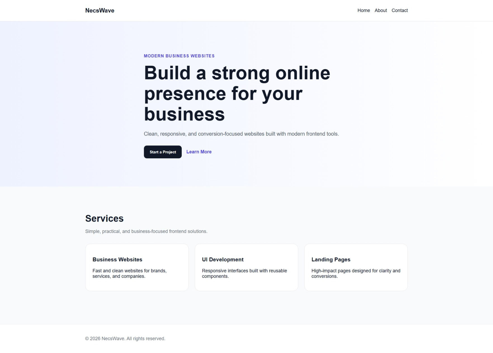
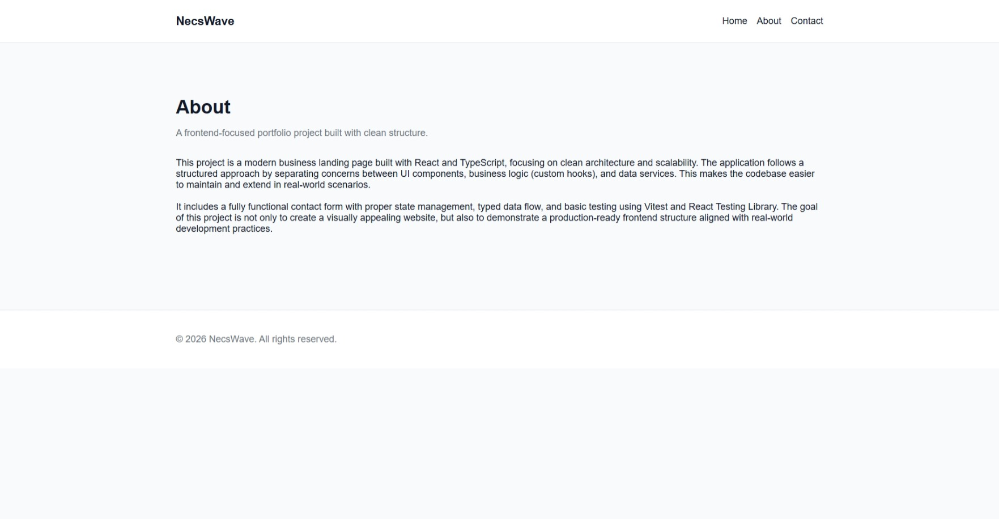
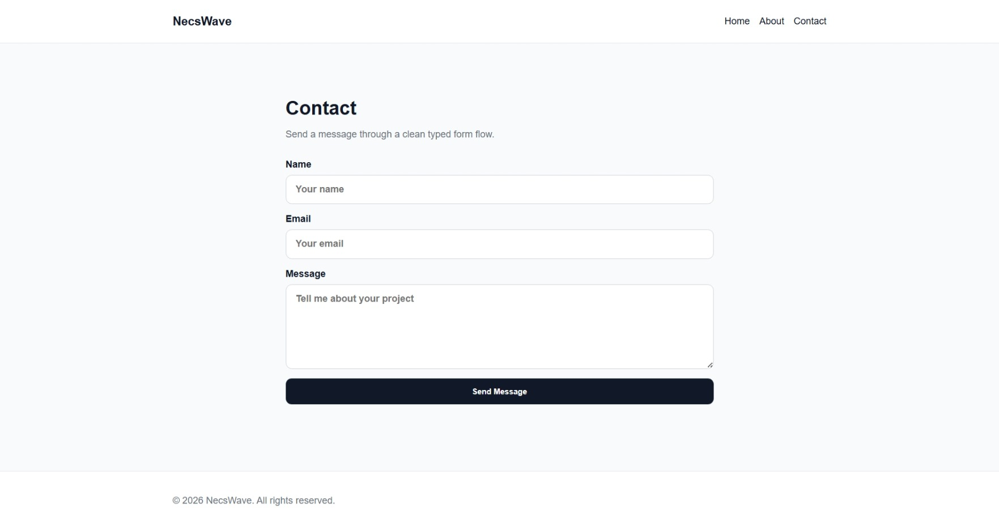

# 🚀 Modern Business Landing Page

A clean, responsive, and scalable business website built with modern frontend technologies.
This project demonstrates a professional React + TypeScript architecture with separation of concerns, reusable components, and basic testing.

---

## 🌐 Live Demo

 **https://modern-business-website-gray.vercel.app/**

---

## 📸 Screenshots

### 🏠 Home Page





### ℹ️ About Page





### 📩 Contact Page





---

## ✨ Features

* ⚡ Built with React + TypeScript
* 🧱 Clean and scalable folder structure
* ♻️ Reusable UI components
* 🎯 Separation of concerns (UI / logic / services)
* 📩 Functional contact form (mock API)
* 🧪 Basic testing with Vitest & React Testing Library
* 📱 Fully responsive design
* 🎨 Modern UI layout

---

## 🛠 Tech Stack

* React
* TypeScript
* Vite
* CSS (custom styling)
* Vitest
* React Testing Library

---

## 📁 Project Structure

```text
src/
├─ app/            # App entry & routing
├─ components/     # UI & layout components
├─ pages/          # Application pages
├─ hooks/          # Custom React hooks (logic)
├─ services/       # API / data layer
├─ types/          # TypeScript types
├─ styles/         # Global styles
```

---

## 🧪 Testing

Basic tests are implemented for user interactions, especially the contact form.

Run tests with:

```bash
npm run test
```

---

## 🚀 Getting Started

Clone the project:

```bash
git clone https://github.com/salamizadeh-dev/modern-business-website.git
cd modern-business-website
```

Install dependencies:

```bash
npm install
```

Run development server:

```bash
npm run dev
```

---

## 🧠 What This Project Demonstrates

This project is built with a focus on:

* Writing clean and maintainable React code
* Structuring scalable frontend applications
* Using TypeScript effectively
* Applying real-world project architecture
* Understanding component separation and reusability

---

## 📌 Future Improvements

* 🔗 Connect contact form to real backend (Email API)
* 🌙 Dark mode support
* 📊 Admin dashboard integration
* ⚙️ Form validation with better UX
* 🌍 Multi-language support

---

## 👤 Author

**Omid Salamizadeh**
Frontend Developer

* LinkedIn: https://www.linkedin.com/in/omid-salamizadeh/
